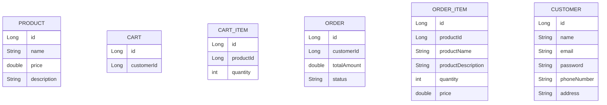

# E-Commerce Application
This project is a backend service for an e-commerce application, built using **Spring Boot** and **Jakarta Persistence API (JPA)**. It provides the foundational data models required to manage products, shopping carts, and orders.


## Features
- **Product Management**: Define and store product details such as name, price, and description.
- **Shopping Cart**: Users can add/remove products to/from their shopping carts.
- **Order Processing**: Users can place orders, and the system manages order status and order items.


## ER Diagram Representation

- Product is associated with CartItem and OrderItem, allowing it to be part of both a cart and an order.
- CartItem belongs to both Cart and Product.
- OrderItem belongs to both Order and Product.

## Flow of Data
1. **Adding a Product to the Cart:** A user selects a Product and adds it to their Cart as a CartItem.
2. **Placing an Order:** When the user proceeds to checkout, the CartItems are converted into OrderItems, and an Order is created.
3. **Processing the Order:** The Order stores the list of OrderItems with prices and quantities.
4. **Completing the Purchase:** The order is processed, and the order status is updated.

## Technologies Used
- Java 17
- Spring Boot 3.4.2
- Spring Data JPA
- Hibernate (ORM)
- Jakarta Persistence API (JPA)
- MySQL (Amazon RDS)
- Kafka
- Docker (for running Kafka)
- Swagger-UI (for API documentation)


## Steps to Run the Application
**Set up Kafka using Docker**:
1. Install [Docker](https://www.docker.com/)
2. Verify Docker by executing the following command:
    ```bash
    docker --version
    ```
3. Run Kafka by executing the following command:
    ```bash
    docker-compose up -d
    ```
4. Verify Kafka is running
    ```bash
    docker ps
    ```

To stop and remove Containers, run
    ```bash
    docker-compose down
    ```

**Run the Application**:
- Clone and open the repository in your IDE (e.g., IntelliJ).
- Set up the MySQL database locally:
  - Create a database named `your_database_name`.
  - Update the `application.yaml` file with your database details.
    Example:
    ```properties
    spring.datasource.url=jdbc:mysql://localhost:3306/your_database_name
    spring.datasource.username=your_mysql_username
    spring.datasource.password=your_mysql_password
    spring.datasource.driver-class-name=com.mysql.cj.jdbc.Driver
    spring.jpa.hibernate.ddl-auto=update
    spring.jpa.show-sql=true
    ```
- Run the Spring Boot application as a Java application.

**Accessing the Application**:
- Open the browser and navigate to `http://localhost:8080` for the application API.
- Use Postman or any API client to interact with the API.


### Configuration

- **Database**: Make sure to configure the MySQL database URL, username, and password in the `application.yaml`.
- **Kafka**: Kafka is set up to run locally on port `9092`. If you are using a remote Kafka service, make sure to update the Kafka settings accordingly.

### Swagger UI

Access Swagger UI at the following URL: `http://localhost:8080/swagger-ui/index.html`

